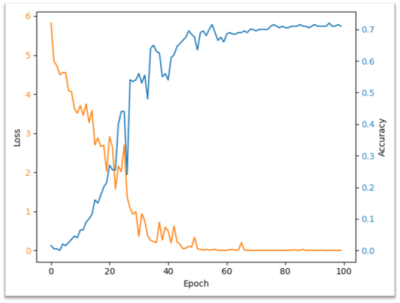
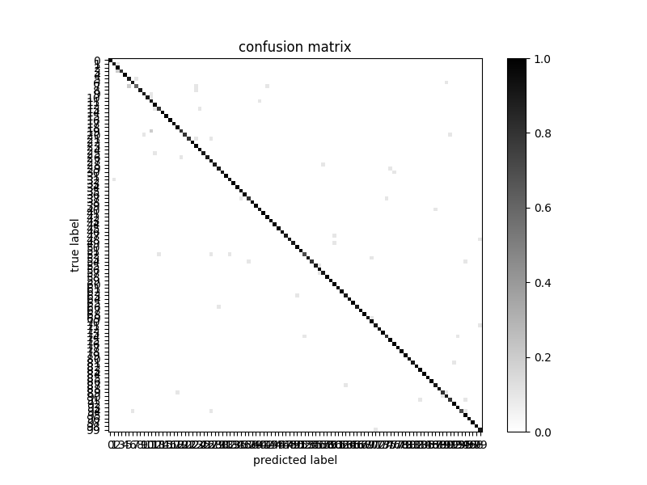

# 自动零售柜商品识别

## 目录构成

```none
> product_identification
    > baseline                  # 基线工程目录
        > output                # 基线输出目录（未上传）
        > txt_data              # 描述性数据集（未上传）
            - mapping.json      # 映射表（未上传）
            - total.txt         # 数据集全集（未上传）
            - train.txt         # 训练集（未上传）
            - val.txt           # 验证集（未上传）
        - baseline.ipynb        # 基线项目
    > data                      # 数据集（未上传）
    > date_before               # 处理前数据（未上传）
    > imagelib                  # 图床
    > tools                     # 工具目录
        - __init__.py           # 初始化文件
        - create_mapping.py     # 创建映射表工具
        - data2txt.py           # 数据转txt描述文件工具
        - rename_file.py        # 根据映射表重命名文件工具
    - .gitignore                # git ignore
    - README.md                 # README
```

## 目前基线表现



基于

- torchvision.models.resnet34(num_classes=100)
- epochs = 100
- batch_size = 64
- cuda加速开启
- optimizer = torch.optim.AdamW(ResNet.parameters(), lr=0.01, weight_decay=1e-3)
- scheduler = torch.optim.lr_scheduler.MultiStepLR(optimizer, [60, 80], 0.1)
- loss_func = nn.CrossEntropyLoss()
- transform = torchvision.transforms.ToTensor()

目前val最高acc=0.7200（第96轮循环）, test最高acc=0.68, total最高acc=0.942

全数据集下预测分布:


